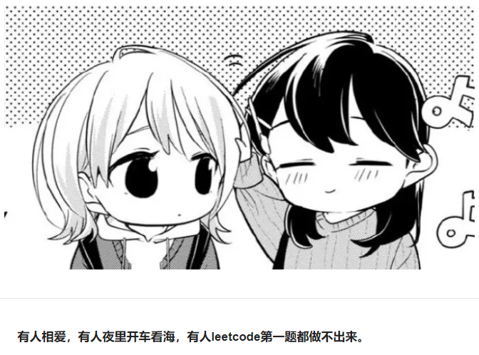

# restaurant-supply-management
## Introduction
This program was first written by Python for gui design and MySQL connector as a course project. Then in order to extend it for online usage, the java version has been developed by author which can be used for reality scenes for Resurants. The further version will extended to a mobile app.

## How to run ?

## Sample functions display

### Login: since most functions were managed by owner, we do not design the registration and adding other members rights in the manage page.
The default login credential is of manager and restraut owner.
eg: management

